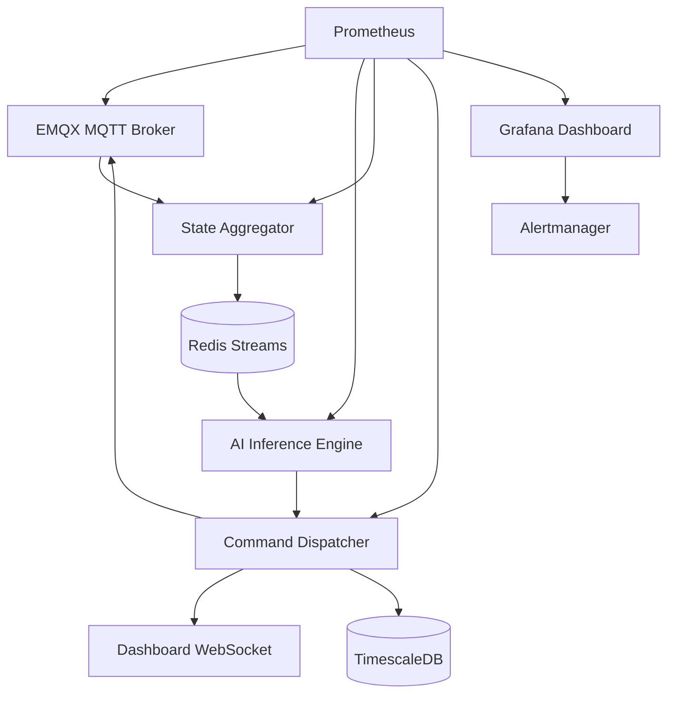

# 🚍 Metrobus AI Command System — DevOps Infrastructure Roadmap

> **Last Updated:** March 24, 2026  
> **Objective:** Design the infrastructure required for a trained AI model to send real-time commands to 250 buses with minimum latency  
> **Scope:** Central server, communication protocols, deployment strategy, and research questions

---

## 1. Current System State

### 1.1 AI Decision Engine (Hybrid Architecture)

The system uses a two-layer decision engine:

| Layer | Engine | Technology | Decision Type |
|-------|--------|------------|---------------|
| **Macro** | MAPPO (Multi-Agent PPO) | PyTorch + CUDA Graph | Station skipping, holding, speed action |
| **Micro** | Predictive Lookahead Engine | IDM mini-simulation | Bunching prevention, speed filtering |

**Outputs:** 10 decisions per bus per second → `SPEED_FILTER`, `BUNCHING_ACCEPT`, `HOLD`, `SKIP`, `NORMAL`

### 1.2 Simulation to Production Gap

```
SIMULATION (current)                PRODUCTION (target)
┌──────────────────┐                ┌──────────────────┐
│ GPU Env (PyTorch)│                │ Real GPS data    │
│ 512 parallel envs│                │ 250 vehicles     │
│ Virtual physics  │                │ Real physics     │
│ WS Bridge → Dash │                │ MQTT → HUD       │
│ 16,000 FPS       │                │ 1-10 Hz          │
└──────────────────┘                └──────────────────┘
         │                                   │
         └──── SHARED: Actor model (30KB) ───┘
               Predictive Engine (CPU)
               State vector (24 dim/bus)
```

---

## 2. Target Infrastructure Architecture

### 2.1 Topology

```
                              ┌─────────────────────────┐
  250 Vehicles                │    CENTRAL CLUSTER      │
  ┌────┐  MQTT (4G/5G)       │                         │
  │ V1 │ ──────────────────→  │  ┌───────────────────┐  │
  ├────┤  gps/{id} (10 Hz)   │  │   EMQX MQTT       │  │
  │ V2 │ ──────────────────→  │  │   Broker Cluster  │  │
  ├────┤                      │  └────────┬──────────┘  │
  │... │                      │           │             │
  ├────┤                      │  ┌────────▼──────────┐  │
  │V250│ ──────────────────→  │  │  State            │  │
  └────┘                      │  │  Aggregator       │  │
    ▲                         │  │  (Redis Streams)  │  │
    │                         │  └────────┬──────────┘  │
    │  MQTT (4G/5G)           │           │             │
    │  cmd/{id} (1 Hz)        │  ┌────────▼──────────┐  │
    │                         │  │  AI Inference     │  │
    └──────────────────────── │  │  ┌──────────────┐ │  │
                              │  │  │MAPPO Actor   │ │  │
                              │  │  │(GPU batch)   │ │  │
                              │  │  ├──────────────┤ │  │
                              │  │  │Predictive    │ │  │
                              │  │  │Engine (CPU)  │ │  │
                              │  │  └──────────────┘ │  │
                              │  └────────┬──────────┘  │
                              │           │             │
                              │  ┌────────▼──────────┐  │
                              │  │  Command          │  │
                              │  │  Dispatcher       │  │
                              │  │  → MQTT publish   │  │
                              │  │  → Dashboard WS   │  │
                              │  │  → TimescaleDB    │  │
                              │  └──────────────────┘  │
                              │                         │
                              │  ┌──────────────────┐   │
                              │  │  Observability    │  │
                              │  │  Prometheus       │  │
                              │  │  Grafana          │  │
                              │  │  Alertmanager     │  │
                              │  └──────────────────┘   │
                              └─────────────────────────┘
```

### 2.2 Component Responsibilities

| Component | Responsibility | Technology | Criticality |
|-----------|---------------|------------|-------------|
| **MQTT Broker** | Vehicle ↔ Server messaging | EMQX (clustered) | 🔴 All communication stops if down |
| **State Aggregator** | Merge state of 250 vehicles | Redis Streams + Python | 🔴 AI input source |
| **AI Inference** | Run model, produce commands | PyTorch (GPU) + Python (CPU) | 🔴 System brain |
| **Command Dispatcher** | Route commands to vehicles | Python + MQTT publish | 🔴 Output channel |
| **TimescaleDB** | Historical data storage | PostgreSQL + TimescaleDB | 🟡 Analytics/offline |
| **Dashboard** | Operator monitoring UI | React + Leaflet + WebSocket | 🟡 Monitoring |
| **Prometheus + Grafana** | System health monitoring | CNCF stack | 🟡 Monitoring |
| **CI/CD Pipeline** | Model and service deployment | GitHub Actions + Docker | 🟢 Development |

---

## 3. Scenario Analysis

### Scenario 1: Normal Operation (Expected Behavior)

```
Time   Event                                            Latency
─────  ──────────────────────────────────────────────   ──────
t=0    Vehicle sends GPS (MQTT publish)                  0ms
t+15   EMQX → State Aggregator (Redis Streams)         15ms
t+18   State Aggregator → AI Inference triggered         3ms
t+20   MAPPO Actor batch inference (250 vehicles)        2ms
t+23   Predictive Engine bunching scan                   3ms
t+25   Command Dispatcher → MQTT publish (cmd/{id})      2ms
t+40   Vehicle receives command, HUD updated            15ms
─────  ──────────────────────────────────────────────   ──────
       TOTAL END-TO-END LATENCY                        ~40ms ✅
```

**Required infrastructure steps:**
1. EMQX MQTT Broker setup (3 node cluster, QoS 1)
2. Redis Streams configuration (per-bus state key, TTL 30s)
3. AI Inference Service containerization (GPU passthrough)
4. MQTT topic ACL definition
5. Health check endpoints

---

### Scenario 2: High Traffic — Rush Hour (07:00-09:00)

```
Normal:  250 vehicles × 10 Hz = 2,500 msg/s
Rush:    250 vehicles × 10 Hz + stop sensors = ~4,000 msg/s
         + More frequent model decision refresh

Bottleneck Analysis:
┌──────────────────┬────────────┬───────────────────────────────┐
│ Component        │ Capacity   │ Rush Hour Load                │
├──────────────────┼────────────┼───────────────────────────────┤
│ EMQX Broker      │ 100K msg/s │ 4K msg/s → 4% capacity ✅     │
│ Redis Streams    │ 500K ops/s │ 8K ops/s → 2% capacity ✅     │
│ GPU Inference    │ 10K inf/s  │ 10 inf/s (batch) → ✅         │
│ CPU (Predictive) │ ~1ms/bus   │ 250ms total → ✅              │
│ 4G Bandwidth     │ ~10 Mbps   │ 1.75 MB/s → ~14 Mbps ⚠️     │
│ TimescaleDB write│ 50K row/s  │ 4K row/s → 8% capacity ✅     │
└──────────────────┴────────────┴───────────────────────────────┘

Critical bottleneck: 4G bandwidth (per-vehicle uplink)
Solution: GPS payload compression (MessagePack) + delta encoding
```

**Required infrastructure steps:**
1. EMQX horizontal scaling policy (CPU >70% → new node)
2. Redis sentinel/cluster configuration
3. MessagePack serialization implementation
4. GPS delta encoding (send only changed fields)
5. Grafana alerting: msg/s threshold definitions

---

### Scenario 3: Connectivity Loss (Tunnel / Dead Zone)

```
t=0     Vehicle enters tunnel, MQTT connection drops
t+5s    EMQX "client offline" event → Alertmanager
t+5s    State Aggregator: bus_42 marked as "stale"
t+5s    AI Engine: continues with last known state for bus_42
t+30s   Vehicle exits tunnel, MQTT auto-reconnect
t+31s   Vehicle sends buffered GPS burst
t+32s   State Aggregator: bus_42 state updated, "active"
t+33s   AI Engine: normal operation with fresh state

Vehicle-side (HUD):
  - t+0-10s: Last received command remains valid
  - t+10-30s: "Weak connection" warning + fixed speed limit
  - t+30s: Reconnect → normal mode
```

**Required infrastructure steps:**
1. EMQX persistent session (clean_session=false, session_expiry=300s)
2. MQTT Last Will & Testament (LWT) message configuration
3. State Aggregator "stale detection" (>5s without update)
4. GPS buffer (vehicle-side): prevent data loss during short outages
5. Alertmanager rule: `bus_offline_count > 10` → notify operators
6. Grafana dashboard: online/offline vehicle map

---

### Scenario 4: AI Service Crash

```
t=0     AI Inference container OOMKilled (memory overflow)
t+1s    Kubernetes pod restart triggered
t+1s    Command Dispatcher: command generation stops
t+1s    MQTT: no messages on cmd/{id} topics
t+5s    Vehicles: last command cached, switch to "NORMAL" mode
t+15s   Kubernetes: new pod ready, GPU warmup begins
t+20s   AI Engine: pulls fresh state from aggregator
t+21s   Normal operation resumes

TOTAL DOWNTIME: ~20 seconds (vehicles apply last command)
```

**Required infrastructure steps:**
1. Kubernetes Deployment: replicas=2 (active-passive or active-active)
2. GPU resource limits + OOM protection
3. Readiness probe: `/health` endpoint (model loaded?)
4. Liveness probe: `/inference` endpoint (inference running?)
5. Pod Disruption Budget: maxUnavailable=1
6. Startup probe: GPU warmup time (30s timeout)
7. MQTT retained message: last command persists on vehicle

---

### Scenario 5: Model Update (New Version Deploy)

```
t=0     New model training completed (actor_v2.pt)
        Uploaded to Model Registry (MLflow/DVC)

t+1m    CI/CD Pipeline triggered:
        1. 1000-step regression test in simulation
        2. KPI comparison (v1 vs v2):
           - Headway variance (↓ better)
           - Bunching rate (↓ better)
           - Average speed (→ stable)

t+5m    Test passed → Canary deployment
        ┌────────────────────────────────┐
        │  Fleet: 250 vehicles           │
        │  ┌──────┐  ┌────────────────┐  │
        │  │ v2   │  │ v1 (current)   │  │
        │  │ 5%   │  │ 95%            │  │
        │  │ 12   │  │ 238 vehicles   │  │
        │  │ vehi.│  │                │  │
        │  └──────┘  └────────────────┘  │
        └────────────────────────────────┘

t+2h    Canary KPIs checked:
        ✅ Headway CoV: 0.28 (v2) vs 0.31 (v1) → improvement
        ✅ Bunching: 3% (v2) vs 5% (v1) → improvement

t+2h    Rolling update begins:
        5% → 25% → 50% → 100%

        If ❌ KPI degradation:
        Automatic rollback → entire fleet reverts to v1
```

**Required infrastructure steps:**
1. Model Registry (MLflow or simple S3 + metadata)
2. CI/CD simulation test stage (GPU runner required)
3. Feature flag system: which vehicle uses which model version
4. KPI collector service: per-group metric aggregation
5. Automated rollback trigger: headway CoV >20% increase → rollback
6. Grafana A/B dashboard: v1 vs v2 live comparison

---

## 4. Kubernetes Cluster Design

### 4.1 Namespace Structure

```
metrobus-prod/
├── mqtt/           → EMQX StatefulSet (3 pods)
├── ai/             → Inference Deployment (2 pods, GPU)
├── data/           → State Aggregator, Command Dispatcher
├── storage/        → TimescaleDB StatefulSet, Redis Sentinel
├── monitoring/     → Prometheus, Grafana, Alertmanager
└── dashboard/      → Dashboard Deployment (2 pods)
```

### 4.2 Pod Manifest

```yaml
# AI Inference — Critical service
apiVersion: apps/v1
kind: Deployment
metadata:
  name: ai-inference
  namespace: metrobus-prod
spec:
  replicas: 2
  strategy:
    type: RollingUpdate
    rollingUpdate:
      maxUnavailable: 0      # Zero downtime
      maxSurge: 1
  template:
    spec:
      containers:
      - name: inference
        image: metrobus/ai-inference:v1.2
        resources:
          requests:
            nvidia.com/gpu: 1
            memory: "4Gi"
            cpu: "4"
          limits:
            nvidia.com/gpu: 1
            memory: "8Gi"
        ports:
        - containerPort: 8080   # Health
        - containerPort: 8765   # WebSocket (dashboard)
        readinessProbe:
          httpGet:
            path: /health
            port: 8080
          initialDelaySeconds: 30  # GPU warmup
          periodSeconds: 5
        livenessProbe:
          httpGet:
            path: /health
            port: 8080
          periodSeconds: 10
          failureThreshold: 3
        env:
        - name: MQTT_BROKER
          value: "emqx-headless.mqtt.svc:1883"
        - name: REDIS_URL
          value: "redis-sentinel.storage.svc:26379"
        - name: MODEL_PATH
          value: "/models/actor_latest.pt"
        volumeMounts:
        - name: model-storage
          mountPath: /models
      volumes:
      - name: model-storage
        persistentVolumeClaim:
          claimName: model-pvc
```

### 4.3 Service Dependency Graph



---

## 5. Data Flow Protocol

### 5.1 MQTT Topic Structure

```
metrobus/              (root namespace)
├── gps/{bus_id}       → Vehicle → Server  (10 Hz, QoS 0)
├── telemetry/{bus_id} → Vehicle → Server  (1 Hz, QoS 1)
├── cmd/{bus_id}       → Server  → Vehicle (1 Hz, QoS 1, retained)
├── status/{bus_id}    → Vehicle → Server  (heartbeat, 5s, QoS 0)
├── alert/global       → Server  → All     (emergency, QoS 2)
└── model/version      → Server  → All     (model update, QoS 2)
```

### 5.2 State Vector (AI Input — Per Vehicle)

```
Obs[0:24] = {
  position_normalized,     # [0,1] position along route
  speed / max_speed,       # [0,1] normalized speed
  dist_to_next_stop,       # meters → normalized
  dist_to_leader,          # distance to vehicle ahead
  leader_speed,            # speed of vehicle ahead
  headway_front,           # forward headway in seconds
  headway_rear,            # rear headway in seconds
  dwell_remaining,         # remaining dwell time at stop
  is_rush_hour,            # 0/1
  stop_passenger_load,     # stop congestion level
  phase_encoding[4],       # one-hot: cruising/approaching/stopped/...
  ...                      # 24-dimensional vector total
}
```

### 5.3 Command Output (AI → Vehicle)

```json
{
  "ts": 1774244500,
  "bus_id": 42,
  "decision": "SPEED_FILTER",
  "v_target_kmh": 31,
  "hud": {
    "command": "SLOW DOWN",
    "reason": "Gap to vehicle ahead is decreasing",
    "color": "#00BCD4",
    "headway_front_s": 45,
    "headway_rear_s": 82
  }
}
```

---

## 6. Observability Layer

### 6.1 Metric Hierarchy

```
LEVEL 1 — Business Metrics (Grafana main dashboard)
├── Headway coefficient of variation (CoV) — Target: <0.30
├── Bunching rate (%) — Target: <5%
├── Average speed (km/h) — Target: ≥35 km/h
└── Command compliance rate (%) — How well drivers follow commands

LEVEL 2 — System Metrics (Ops dashboard)
├── MQTT message throughput (msg/s)
├── Command latency P50/P95/P99 (ms)
├── AI inference time (ms)
├── Vehicle online rate (%)
└── Redis memory usage

LEVEL 3 — Infrastructure Metrics (Kubernetes dashboard)
├── Pod CPU/RAM usage
├── GPU utilization (%)
├── Disk I/O (TimescaleDB)
├── Network throughput
└── Pod restart count
```

### 6.2 Alert Rules

| Alert | Condition | Severity | Action |
|-------|-----------|----------|--------|
| `BusOfflineHigh` | >10 vehicles offline, 2 min | 🔴 Critical | SMS + Slack to ops team |
| `InferenceLatencyHigh` | P95 >100ms, 5 min | 🔴 Critical | Trigger pod restart |
| `MQTTBrokerDown` | EMQX pod <2/3, 1 min | 🔴 Critical | On-call page |
| `HeadwayDegradation` | CoV >0.50, 10 min | 🟡 Warning | Evaluate model rollback |
| `BunchingSpike` | >15% bunching, 15 min | 🟡 Warning | Dashboard alert |
| `DiskSpaceLow` | TimescaleDB >80%, — | 🟢 Info | Automation: purge old data |

---

## 7. Step-by-Step Deployment Plan

### Phase 0: Infrastructure Setup (Week 1-2)

```
☐ Kubernetes cluster setup (3 master, 3+ worker, 1 GPU node)
☐ EMQX Operator installation + MQTT broker cluster (3 nodes)
☐ Redis Sentinel setup (1 master + 2 replicas)
☐ TimescaleDB setup (HA, continuous aggregates)
☐ Prometheus + Grafana + Alertmanager stack
☐ Container registry (Harbor or DockerHub private)
☐ Network policies: namespace isolation
☐ TLS certificates (cert-manager + Let's Encrypt)
```

### Phase 1: AI Service Containerization (Week 3-4)

```
☐ Build AI Inference service Docker image
  ├── Base: nvidia/cuda:12.x-runtime
  ├── PyTorch + ONNX Runtime
  ├── MQTT client (paho-mqtt)
  ├── Actor model file (/models/actor_latest.pt)
  └── Predictive engine module
☐ Containerize State Aggregator service
  ├── Redis Streams consumer
  ├── 250 vehicle state merging
  └── State vector delivery to AI Engine
☐ Containerize Command Dispatcher service
  ├── Publish AI output to MQTT cmd/{id} topic
  ├── Dashboard WebSocket broadcast
  └── TimescaleDB logging
☐ GPU passthrough test (nvidia-smi must work inside pod)
☐ End-to-end test: simulated MQTT messages → AI command → back to MQTT
```

### Phase 2: Dashboard & Monitoring (Week 5-6)

```
☐ Deploy Dashboard to Kubernetes
  ├── Real-time vehicle data via MQTT
  ├── Predictive engine visualization (existing)
  └── Headway / bunching overlay
☐ Create Grafana dashboards
  ├── Operations dashboard (business metrics)
  ├── System dashboard (latency, throughput)
  └── Kubernetes dashboard (pod health)
☐ Define alert rules (table above)
☐ On-call rotation and escalation procedure
```

### Phase 3: Pilot Integration (Week 7-10)

```
☐ Launch pilot with 5 vehicles
  ├── Install MQTT client on vehicles
  ├── Validate GPS → MQTT publish flow
  ├── Validate cmd/{id} → HUD display
  └── End-to-end latency measurement (<100ms target)
☐ A/B test infrastructure: pilot vehicles with AI commands, others normal
☐ 2-week pilot data collection
☐ KPI analysis: is headway improvement measurable?
```

### Phase 4: Full Fleet Rollout (Week 11-16)

```
☐ Rolling deployment: 5 → 25 → 80 → 250 vehicles
☐ Canary mechanism active at each stage
☐ Load test: 250 vehicles simultaneous MQTT traffic
☐ Failure injection: MQTT broker node kill, AI pod kill
☐ Disaster recovery test: full cluster restart
```

---

## 8. CI/CD Pipeline

```
┌─────────┐    ┌───────────┐    ┌──────────────┐    ┌─────────────┐
│  Code   │    │  Build    │    │  Test        │    │  Deploy     │
│  Push   │ →  │           │ →  │              │ →  │             │
│         │    │  Docker   │    │  Unit tests  │    │  Canary 5%  │
│  or     │    │  image    │    │  Sim regr.   │    │  KPI watch  │
│  Model  │    │  build    │    │  GPU bench   │    │  Rolling    │
│  Commit │    │           │    │              │    │  25→50→100% │
└─────────┘    └───────────┘    └──────────────┘    └─────────────┘
                                       │                    │
                                  Failure →            KPI bad →
                                  Pipeline stops       Automatic rollback
```

### Pipeline Stages

1. **Build:** Docker multi-stage build (CUDA base + Python deps + model)
2. **Unit Test:** Predictive engine tests (16/16 pass required)
3. **Sim Regression:** 1000-step simulation, KPI threshold check
4. **GPU Benchmark:** Inference latency <5ms assertion
5. **Canary Deploy:** New version to 5% of fleet
6. **KPI Gate:** 2-hour monitoring, headway CoV comparison
7. **Rolling Update:** Gradual full fleet transition

---

## 9. Security Architecture

```
┌─────────────────────────────────────────────────────┐
│                  SECURITY LAYERS                    │
│                                                     │
│  Layer 1: Network                                   │
│  └── WireGuard VPN tunnel (vehicle ↔ server)        │
│  └── Kubernetes NetworkPolicy (namespace isolation) │
│                                                     │
│  Layer 2: Authentication                            │
│  └── mTLS: each vehicle has its own X.509 cert      │
│  └── MQTT username/password + ACL                   │
│  └── Vehicle can only access its own topics         │
│      (gps/42 write, cmd/42 read)                    │
│                                                     │
│  Layer 3: Data Integrity                            │
│  └── Command signing (HMAC-SHA256)                  │
│  └── Prevents fake command injection                │
│                                                     │
│  Layer 4: Privacy                                   │
│  └── GPS data anonymized (bus_id = internal ID)     │
│  └── Passenger data stays on vehicle, not sent      │
│  └── GDPR / KVKK compliance                        │
└─────────────────────────────────────────────────────┘
```

---

## 10. Disaster Recovery (DR) Scenarios

| Scenario | Impact | Recovery Time (RTO) | Action |
|----------|--------|--------------------|--------|
| MQTT broker 1/3 node failure | None (HA) | 0s | EMQX automatic failover |
| MQTT broker total failure | Command communication stops | <60s | K8s StatefulSet restart |
| AI Inference OOM | Command generation stops | <20s | K8s pod restart + GPU warmup |
| Redis data loss | State loss | <5s | Sentinel failover + rebuild from GPS |
| TimescaleDB crash | Historical data unwritable | <5m | Replica promotion |
| Full DC loss | Entire system down | <30m | DR site activation |
| Model corruption | Incorrect commands | <5m | Automatic rollback (KPI gate) |

---

## 11. Research Questions and Thesis Topics

### 🔬 RQ1: Data Freshness and Decision Quality

**Main Question:** *In real-time multi-agent systems, how does vehicle location data staleness affect AI decision quality?*

**Sub-Questions:**
- How does headway coefficient of variation (CoV) change with 1s, 5s, 10s, 30s GPS delay?
- How does fleet size (50, 100, 250 vehicles) affect staleness tolerance?
- Which vehicles' stale data is more critical? (Those in bunching zones or free-flowing?)
- How effectively can dead reckoning (last speed + direction estimation) compensate for stale data?

**Hypothesis:** GPS delay exceeding 5 seconds reduces bunching detection accuracy by more than 30% and measurably decreases AI command effectiveness.

**Methodology:**
```
1. Controlled delay injection in simulation:
   - Add t seconds delay to random k vehicles out of N
   - k = {1, 5, 10, 25, 50}, t = {1, 5, 10, 30}
   
2. Metrics:
   - Headway CoV (spacing regularity)
   - Bunching detection precision/recall
   - False positive command rate
   - Average passenger wait time

3. Baseline: t=0 (perfect data) vs experimental groups
```

**Expected Finding:** Delay tolerance curve is sigmoidal — quality is maintained up to a threshold, then drops rapidly. This threshold depends on fleet size and traffic density.

**Literature References:**
- Real-time data quality in IoT systems (Karkouch et al., 2016)
- Staleness-aware scheduling in distributed systems
- Data freshness metrics: Age of Information (AoI) theory

---

### 🔬 RQ2: Fault Tolerance and Graceful Degradation

**Main Question:** *How should graceful degradation strategies be designed for AI-powered public transit management systems during cascading component failures?*

**Sub-Questions:**
- When the MQTT broker crashes, how long does the last command cache remain valid on vehicles?
- When AI inference is unavailable for 20 seconds, how much does fleet headway regularity degrade?
- In multi-failure scenarios (MQTT + AI crash simultaneously), how is minimum safe operation ensured?
- What is the average recovery time (MTTR) of self-healing mechanisms (K8s restart, sentinel failover) under real-world conditions?

**Hypothesis:** A 3-layer degradation strategy (cache → fallback rules → fixed speed) keeps headway CoV degradation below 50% even during 60-second full system outages.

**Methodology:**
```
1. Chaos Engineering approach:
   - Single component failures: MQTT, Redis, AI, TimescaleDB separately
   - Multi-failures: MQTT + AI, Redis + AI
   - Cascading failures: 1 node → 2 nodes → full cluster
   
2. Measurements per scenario:
   - Time to Detect (TTD): time to recognize failure
   - Time to Recover (TTR): time to resume normal operation
   - Decision Quality During Failure (DQDF): decision quality during outage
   - Passenger Impact Score: effect on passenger wait times

3. Comparison:
   - System with vs without degradation strategy
   - Different cache durations (5s, 15s, 30s, 60s)
```

**Expected Finding:** Cache + fallback rules combination makes short failures (<30s) nearly invisible. For long failures (>60s), falling back to fixed speed limits prevents chaotic behavior.

**Literature References:**
- Chaos Engineering (Netflix, Principles of Chaos)
- Fault tolerance in cyber-physical systems
- Graceful degradation patterns in safety-critical systems

---

### 🔬 RQ3: Model Deployment and Online Learning

**Main Question:** *What canary deployment strategies provide optimal results for safely updating a multi-agent RL model in production?*

**Sub-Questions:**
- What is the minimum observation window to detect poor performance of a new model version?
- What percentage of the fleet should receive canary deployment (risk vs statistical power balance)?
- During A/B testing, how does interaction between two model versions affect decisions? (Do vehicles following different policies disrupt each other?)
- Online fine-tuning: can the model be updated live with production data? What is the catastrophic forgetting risk?
- Model drift detection: what metrics automatically detect declining model performance over time?

**Hypothesis:** 5% fleet canary deployment + 2-hour KPI monitoring window catches bad model updates with 95% probability without production impact.

**Methodology:**
```
1. Model version transition in simulation:
   - v1 (baseline) → v2 (improved) → v3 (intentionally bad)
   - Canary: 5%, 10%, 20% fleet ratios
   - Monitoring window: 30min, 1h, 2h, 4h
   
2. Metrics:
   - Detection Rate: catching bad model
   - False Alarm Rate: incorrectly rejecting good model
   - Impact Window: passengers affected before bad model detected
   - Statistical Power: at which canary size is significant difference detectable

3. Cross-policy interaction analysis:
   - Half fleet on v1, half on v2 → does it disrupt each other's headway?
```

**Literature References:**
- Safe reinforcement learning deployment (García & Fernández, 2015)
- Canary deployment patterns in ML systems (Google MLOps)
- Multi-agent policy heterogeneity effects
- Continual learning and catastrophic forgetting

---

### 🔬 RQ4: Scalability and Latency Optimization

**Main Question:** *How should message broker, state aggregation, and inference pipeline be optimized to keep end-to-end command latency below 100ms for a 250+ vehicle fleet?*

**Sub-Questions:**
- How does MQTT message throughput scale as fleet grows (50 → 100 → 250 → 500 vehicles)?
- What is the latency-throughput trade-off of batch vs streaming approaches in state aggregation?
- How does GPU batch inference size (1, 32, 128, 256 vehicles) affect latency?
- How much does GPS message compression (MessagePack, delta encoding, protobuf) reduce bandwidth?
- Can the impact of 4G-to-5G transition on end-to-end latency be measured?

**Hypothesis:** Optimal batch size (single batch equal to vehicle count) and Redis Streams pipeline can keep P99 latency below 80ms for a 250-vehicle fleet.

**Methodology:**
```
1. Benchmark environment:
   - Simulated MQTT traffic: 50, 100, 250, 500 virtual vehicles
   - Each vehicle sends 10 Hz GPS
   - EMQX cluster: 1, 3, 5 node configurations

2. Latency measurement points:
   t1: GPS message leaves vehicle
   t2: Arrives at EMQX broker
   t3: State Aggregator processes
   t4: AI inference begins
   t5: Command written to MQTT
   t6: Vehicle receives command
   
   Per stage: P50, P95, P99, max

3. Optimization experiments:
   - Serialization: JSON vs MessagePack vs Protobuf
   - Batch: one-by-one vs micro-batch vs full-batch inference
   - Pipeline: sequential vs pipeline parallelism
```

**Expected Finding:** The bottleneck is GPS serialization + 4G RTT. Inference time is negligible (<2ms). MessagePack + delta encoding reduces payload by 70%.

**Literature References:**
- MQTT broker scalability studies
- Latency optimization in real-time inference pipelines
- Edge vs cloud inference latency trade-offs
- Message serialization benchmarks in IoT

---

### 🔬 RQ5: Security and Adversarial Attack Vectors

**Main Question:** *What are the cyber attack vectors against real-time public transit AI systems and what defense layers are required?*

**Sub-Questions:**
- GPS spoofing: How does the AI make wrong decisions if fake location data is injected?
- Command injection: How is the fleet affected if a fake "SLOW DOWN" command is sent?
- Model inversion: Can model weights be reverse-engineered from command patterns?
- DDoS: How much are real messages delayed if the MQTT broker is flooded with excessive traffic?
- Insider threat: What protection mechanism exists if an authorized operator sends incorrect commands to the entire fleet?

**Hypothesis:** A 4-layer security architecture (network, identity, integrity, privacy) reduces the attack surface by 90%, but GPS spoofing remains the hardest vector to defend against.

**Methodology:**
```
1. Threat modeling (STRIDE):
   - Spoofing: fake vehicle/GPS
   - Tampering: command modification
   - Repudiation: non-repudiation
   - Information Disclosure: data leakage
   - Denial of Service: service disruption
   - Elevation of Privilege: privilege escalation

2. Attack simulations:
   - GPS spoofing: randomly shift N vehicles' positions
   - Command injection: send fake MQTT messages
   - DDoS: 10x normal traffic load
   
3. Defense effectiveness:
   - mTLS: authentication effectiveness
   - HMAC: command integrity protection
   - Rate limiting: DDoS impact reduction
   - Anomaly detection: automatic fake GPS detection
```

**Literature References:**
- Security of cyber-physical transportation systems
- GPS spoofing detection methods
- MQTT security best practices (OWASP IoT)
- Adversarial attacks on reinforcement learning

---

### 🔬 RQ6: Observability and Anomaly Detection

**Main Question:** *How should operational anomaly detection and root cause analysis be performed in multi-component real-time AI pipelines?*

**Sub-Questions:**
- How can declining AI decision quality be automatically detected? (Reward drift, headway degradation)
- What is the correlation between infrastructure metrics (CPU, memory, network) and AI metrics (decision quality, latency)?
- Can distributed tracing track a single GPS message's journey through the 6-stage pipeline?
- Proactive anomaly detection: what leading indicators can catch failures BEFORE they occur?
- Alert fatigue: too many alerts desensitize operators — how are optimal alert thresholds determined?

**Hypothesis:** When infrastructure metrics and AI metrics are analyzed together, 70% of failures can be predicted 5-10 minutes before they occur.

**Methodology:**
```
1. Metric collection:
   - 3 levels × 20+ metrics = 60+ time series
   - 1 week continuous collection (normal + failure periods)

2. Correlation analysis:
   - Infrastructure metric change → AI metric change lag time
   - Granger causality test: which metric predicts which?

3. Anomaly detection model:
   - Unsupervised: isolation forest, autoencoder
   - Supervised: with labeled failure data
   - Comparison: precision/recall/F1 + lead time
   
4. Alert optimization:
   - ROC curve for optimal threshold determination
   - Alert grouping: reduce related alarms to single notification
```

**Literature References:**
- AIOps: AI for IT operations (Gartner)
- Anomaly detection in microservice architectures
- Distributed tracing (Jaeger, OpenTelemetry)
- Alert fatigue in monitoring systems

---

## 12. Research Questions Summary Map

```
                    ┌─────────────────────────┐
                    │  REAL-TIME AI            │
                    │  PUBLIC TRANSIT SYSTEM   │
                    └────────────┬────────────┘
                                 │
         ┌───────────────────────┼───────────────────────┐
         │                       │                       │
   ┌─────▼─────┐          ┌─────▼─────┐          ┌─────▼─────┐
   │  DATA     │          │  DECISION │          │  COMMS    │
   │  LAYER    │          │  LAYER    │          │  LAYER    │
   └─────┬─────┘          └─────┬─────┘          └─────┬─────┘
         │                       │                       │
   RQ1: Staleness          RQ3: Model Deploy       RQ4: Scalability
   RQ6: Anomaly            RQ5: Security           RQ2: Fault Tolerance
```

| RQ | Difficulty | Academic Novelty | Practical Impact | Priority |
|----|-----------|-----------------|-----------------|----------|
| RQ1: Data Freshness | ⭐⭐ | ⭐⭐⭐⭐ | ⭐⭐⭐⭐⭐ | 🥇 |
| RQ2: Fault Tolerance | ⭐⭐⭐ | ⭐⭐⭐ | ⭐⭐⭐⭐⭐ | 🥇 |
| RQ3: Model Deployment | ⭐⭐⭐⭐ | ⭐⭐⭐⭐⭐ | ⭐⭐⭐⭐ | 🥈 |
| RQ4: Scalability | ⭐⭐ | ⭐⭐⭐ | ⭐⭐⭐⭐ | 🥈 |
| RQ5: Security | ⭐⭐⭐⭐ | ⭐⭐⭐⭐ | ⭐⭐⭐ | 🥉 |
| RQ6: Observability | ⭐⭐⭐ | ⭐⭐⭐⭐ | ⭐⭐⭐⭐ | 🥉 |

---

> **This document** is updated as the system architecture evolves. Latest changes: Hybrid AI engine (MAPPO + Predictive Engine), CUDA Graph optimization, JS-Python linearization cache synchronization, research questions added.
