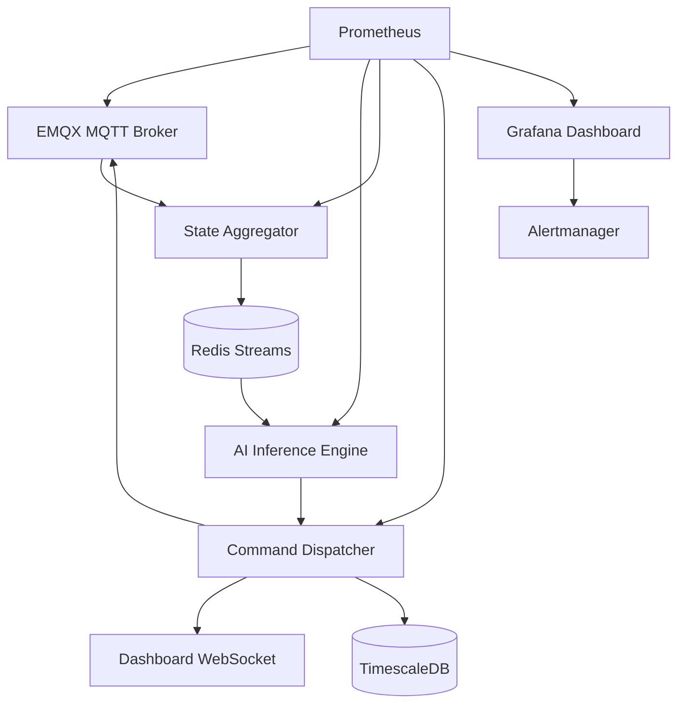

# 🚍 Metrobüs AI Komut Sistemi — DevOps Altyapı Haritası

> **Son Güncelleme:** 23 Mart 2026  
> **Amaç:** Eğitilmiş yapay zeka modelinin 250 otobüse gerçek zamanlı komut göndermesi için gerekli altyapı mimarisi, senaryolar ve adım adım devreye alma planı

---

## 1. Sistemin Mevcut Durumu

### 1.1 AI Karar Motoru (Hibrit Mimari)

Sistem iki katmanlı bir karar motoru kullanır:

| Katman | Motor | Teknoloji | Karar Tipi |
|--------|-------|-----------|------------|
| **Makro** | MAPPO (Multi-Agent PPO) | PyTorch + CUDA Graph | Durak atlama, holding, hız aksiyonu |
| **Mikro** | Predictive Lookahead Engine | IDM mini-simülasyon | Bunching önleme, hız filtreleme |

**Çıktılar:** Her otobüs için saniyede 10 kez karar üretilir → `SPEED_FILTER`, `BUNCHING_ACCEPT`, `HOLD`, `SKIP`, `NORMAL`

### 1.2 Simülasyon Ortamından Üretime Geçiş Farkı

```
SİMÜLASYON (şu an)                    ÜRETİM (hedef)
┌──────────────────┐                  ┌──────────────────┐
│ GPU Env (PyTorch)│                  │ Gerçek GPS verisi│
│ 512 paralel env  │                  │ 250 araç         │
│ Sanal fizik (IDM)│                  │ Gerçek fizik     │
│ WS Bridge → Dash │                  │ MQTT → HUD       │
│ 16,000 FPS       │                  │ 1-10 Hz          │
└──────────────────┘                  └──────────────────┘
         │                                     │
         └──── ORTAK: Actor model (30KB) ──────┘
               Predictive Engine (CPU)
               State vektörü (24 dim/araç)
```

---

## 2. Hedef Altyapı Mimarisi

### 2.1 Topoloji

```
                              ┌─────────────────────────┐
  250 Araç                    │    MERKEZİ KÜME         │
  ┌────┐  MQTT (4G/5G)       │                         │
  │ A1 │ ──────────────────→  │  ┌───────────────────┐  │
  ├────┤  gps/{id} (10 Hz)   │  │   EMQX MQTT       │  │
  │ A2 │ ──────────────────→  │  │   Broker Cluster  │  │
  ├────┤                      │  └────────┬──────────┘  │
  │... │                      │           │             │
  ├────┤                      │  ┌────────▼──────────┐  │
  │A250│ ──────────────────→  │  │  State            │  │
  └────┘                      │  │  Aggregator       │  │
    ▲                         │  │  (Redis Streams)  │  │
    │                         │  └────────┬──────────┘  │
    │  MQTT (4G/5G)           │           │             │
    │  cmd/{id} (1 Hz)        │  ┌────────▼──────────┐  │
    │                         │  │  AI Inference     │  │
    └──────────────────────── │  │  ┌──────────────┐ │  │
                              │  │  │MAPPO Actor   │ │  │
                              │  │  │(GPU batch)   │ │  │
                              │  │  ├──────────────┤ │  │
                              │  │  │Predictive    │ │  │
                              │  │  │Engine (CPU)  │ │  │
                              │  │  └──────────────┘ │  │
                              │  └────────┬──────────┘  │
                              │           │             │
                              │  ┌────────▼──────────┐  │
                              │  │  Command          │  │
                              │  │  Dispatcher       │  │
                              │  │  → MQTT publish   │  │
                              │  │  → Dashboard WS   │  │
                              │  │  → TimescaleDB    │  │
                              │  └──────────────────┘  │
                              │                         │
                              │  ┌──────────────────┐   │
                              │  │  Gözlemlenebilirlik│  │
                              │  │  Prometheus       │  │
                              │  │  Grafana          │  │
                              │  │  Alertmanager     │  │
                              │  └──────────────────┘   │
                              └─────────────────────────┘
```

### 2.2 Bileşen Sorumlulukları

| Bileşen | Sorumluluk | Teknoloji | Kritiklik |
|---------|-----------|-----------|-----------|
| **MQTT Broker** | Araç ↔ Sunucu mesajlaşma | EMQX (clustered) | 🔴 Çökerse tüm iletişim durur |
| **State Aggregator** | 250 aracın anlık durumunu birleştirme | Redis Streams + Python | 🔴 AI'ın girdi kaynağı |
| **AI Inference** | Model çalıştırma, komut üretme | PyTorch (GPU) + Python (CPU) | 🔴 Sistemin beyni |
| **Command Dispatcher** | Komutları araca yönlendirme | Python + MQTT publish | 🔴 Çıktı kanalı |
| **TimescaleDB** | Tarihsel veri saklama | PostgreSQL + TimescaleDB | 🟡 Analiz/offline |
| **Dashboard** | Operatör izleme arayüzü | React + Leaflet + WebSocket | 🟡 İzleme |
| **Prometheus + Grafana** | Sistem sağlığı izleme | CNCF stack | 🟡 Monitoring |
| **CI/CD Pipeline** | Model ve servis dağıtımı | GitHub Actions + Docker | 🟢 Geliştirme |

---

## 3. Senaryo Analizi

### Senaryo 1: Normal Operasyon (Olması Gereken)

```
Zaman  Olay                                          Gecikme
─────  ────────────────────────────────────────────   ──────
t=0    Araç GPS gönderir (MQTT publish)               0ms
t+15   EMQX → State Aggregator (Redis Streams)       15ms
t+18   State Aggregator → AI Inference tetiklenir      3ms
t+20   MAPPO Actor batch inference (250 araç birden)   2ms
t+23   Predictive Engine bunching taraması              3ms
t+25   Command Dispatcher → MQTT publish (cmd/{id})    2ms
t+40   Araç komutu alır, HUD güncellenir              15ms
─────  ────────────────────────────────────────────   ──────
       TOPLAM UÇTAN UCA GECİKME                      ~40ms ✅
```

**Gerekli altyapı adımları:**
1. EMQX MQTT Broker kurulumu (3 node cluster, QoS 1)
2. Redis Streams yapılandırması (per-bus state key, TTL 30s)
3. AI Inference Service containerization (GPU passthrough)
4. MQTT topic ACL tanımlaması
5. Health check endpoint'leri

---

### Senaryo 2: Yüksek Trafik — Rush Hour (07:00-09:00)

```
Normal:  250 araç × 10 Hz = 2,500 msg/s
Rush:    250 araç × 10 Hz + durak sensörleri = ~4,000 msg/s
         + Model kararlarının daha sık yenilenmesi

Darboğaz Analizi:
┌──────────────────┬────────────┬─────────────────────────────┐
│ Bileşen          │ Kapasitesi │ Rush Hour Yüklenmesi        │
├──────────────────┼────────────┼─────────────────────────────┤
│ EMQX Broker      │ 100K msg/s │ 4K msg/s → %4 kapasite ✅   │
│ Redis Streams    │ 500K ops/s │ 8K ops/s → %2 kapasite ✅   │
│ GPU Inference    │ 10K inf/s  │ 10 inf/s (batch) → ✅       │
│ CPU (Predictive) │ ~1ms/araç  │ 250ms toplam → ✅           │
│ 4G Bant genişliği│ ~10 Mbps   │ 1.75 MB/s → ~14 Mbps ⚠️   │
│ TimescaleDB yazma│ 50K row/s  │ 4K row/s → %8 kapasite ✅   │
└──────────────────┴────────────┴─────────────────────────────┘

Kritik darboğaz: 4G bant genişliği (araç başı uplink)
Çözüm: GPS payload sıkıştırma (MessagePack) + delta encoding
```

**Gerekli altyapı adımları:**
1. EMQX horizontal scaling policy (CPU >70% → yeni node)
2. Redis sentinel/cluster yapılandırması
3. MessagePack serialization implementasyonu
4. GPS delta encoding (sadece değişen field gönderme)
5. Grafana alerting: msg/s threshold tanımları

---

### Senaryo 3: Bağlantı Kopması (Tünel / Kör Nokta)

```
t=0     Araç tünele girer, MQTT bağlantısı kopar
t+5s    EMQX "client offline" event'i → Alertmanager
t+5s    State Aggregator: bus_42 durumu "stale" olarak işaretlenir
t+5s    AI Engine: bus_42 için son bilinen state ile karar üretmeye devam eder
t+30s   Araç tünelden çıkar, MQTT otomatik reconnect
t+31s   Araç birikmiş GPS buffer'ını gönderir (burst)
t+32s   State Aggregator: bus_42 state'i güncellenir, "active"
t+33s   AI Engine: güncel state ile normal operasyon

Araç tarafı (HUD):
  - t+0-10s: Son alınan komut geçerli
  - t+10-30s: "Bağlantı zayıf" uyarısı + sabit hız limiti
  - t+30s: Reconnect → normal mod
```

**Gerekli altyapı adımları:**
1. EMQX persistent session (clean_session=false, session_expiry=300s)
2. MQTT Last Will & Testament (LWT) mesajı yapılandırması
3. State Aggregator'da "stale detection" (>5s güncelleme yok)
4. GPS buffer (araç tarafı): kısa kesintilerde veri kaybı önleme
5. Alertmanager rule: `bus_offline_count > 10` → operatöre bildirim
6. Grafana dashboard: çevrimiçi/çevrimdışı araç haritası

---

### Senaryo 4: AI Servisi Çökmesi

```
t=0     AI Inference container OOMKilled (bellek taşması)
t+1s    Kubernetes pod restart tetiklenir
t+1s    Command Dispatcher: komut üretimi durur
t+1s    MQTT: cmd/{id} topic'lerine mesaj gelmez
t+5s    Araçlar: son komut önbellekte, "NORMAL" moda geçer
t+15s   Kubernetes: yeni pod hazır, GPU warmup başlar
t+20s   AI Engine: state aggregator'dan güncel state çeker
t+21s   Normal operasyon devam eder

TOPLAM KESİNTİ: ~20 saniye (araçlar son komutu uygular)
```

**Gerekli altyapı adımları:**
1. Kubernetes Deployment: replicas=2 (active-passive veya active-active)
2. GPU resource limits + OOM protection
3. Readiness probe: `/health` endpoint (model yüklenmiş mi?)
4. Liveness probe: `/inference` endpoint (inference çalışıyor mu?)
5. Pod Disruption Budget: maxUnavailable=1
6. Startup probe: GPU warmup süresi (30s timeout)
7. MQTT retained message: son komut araçta kalır

---

### Senaryo 5: Model Güncelleme (Yeni Versiyon Deploy)

```
t=0     Yeni model eğitimi tamamlandı (actor_v2.pt)
        Model Registry'ye yüklendi (MLflow/DVC)

t+1m    CI/CD Pipeline tetiklenir:
        1. Simülasyonda 1000 step regresyon testi
        2. KPI karşılaştırması (v1 vs v2):
           - Headway varyansı (↓ iyi)
           - Bunching oranı (↓ iyi)
           - Ortalama hız (→ sabit)

t+5m    Test başarılı → Canary deployment
        ┌────────────────────────────────┐
        │  Filo: 250 araç                │
        │  ┌──────┐  ┌────────────────┐  │
        │  │ v2   │  │ v1 (mevcut)    │  │
        │  │ %5   │  │ %95            │  │
        │  │ 12   │  │ 238 araç       │  │
        │  │ araç │  │                │  │
        │  └──────┘  └────────────────┘  │
        └────────────────────────────────┘

t+2h    Canary KPI'ları kontrol edilir:
        ✅ Headway CoV: 0.28 (v2) vs 0.31 (v1) → iyileşme
        ✅ Bunching: %3 (v2) vs %5 (v1) → iyileşme

t+2h    Rolling update başlar:
        %5 → %25 → %50 → %100

        Eğer ❌ KPI kötüleşmesi:
        Otomatik rollback → tüm filo v1'e geri döner
```

**Gerekli altyapı adımları:**
1. Model Registry (MLflow veya basit S3 + metadata)
2. CI/CD simülasyon test stage (GPU runner gerekli)
3. Feature flag sistemi: hangi araç hangi model versiyonunu kullanacak
4. KPI collector servisi: araç grupları bazında metrik toplama
5. Automated rollback trigger: headway CoV >%20 artış → rollback
6. Grafana A/B dashboard: v1 vs v2 canlı karşılaştırma

---

## 4. Kubernetes Cluster Tasarımı

### 4.1 Namespace Yapısı

```
metrobus-prod/
├── mqtt/           → EMQX StatefulSet (3 pod)
├── ai/             → Inference Deployment (2 pod, GPU)
├── data/           → State Aggregator, Command Dispatcher
├── storage/        → TimescaleDB StatefulSet, Redis Sentinel
├── monitoring/     → Prometheus, Grafana, Alertmanager
└── dashboard/      → Dashboard Deployment (2 pod)
```

### 4.2 Pod Haritası

```yaml
# AI Inference — Kritik servis
apiVersion: apps/v1
kind: Deployment
metadata:
  name: ai-inference
  namespace: metrobus-prod
spec:
  replicas: 2
  strategy:
    type: RollingUpdate
    rollingUpdate:
      maxUnavailable: 0      # Sıfır kesinti
      maxSurge: 1
  template:
    spec:
      containers:
      - name: inference
        image: metrobus/ai-inference:v1.2
        resources:
          requests:
            nvidia.com/gpu: 1
            memory: "4Gi"
            cpu: "4"
          limits:
            nvidia.com/gpu: 1
            memory: "8Gi"
        ports:
        - containerPort: 8080   # Health
        - containerPort: 8765   # WebSocket (dashboard)
        readinessProbe:
          httpGet:
            path: /health
            port: 8080
          initialDelaySeconds: 30  # GPU warmup
          periodSeconds: 5
        livenessProbe:
          httpGet:
            path: /health
            port: 8080
          periodSeconds: 10
          failureThreshold: 3
        env:
        - name: MQTT_BROKER
          value: "emqx-headless.mqtt.svc:1883"
        - name: REDIS_URL
          value: "redis-sentinel.storage.svc:26379"
        - name: MODEL_PATH
          value: "/models/actor_latest.pt"
        volumeMounts:
        - name: model-storage
          mountPath: /models
      volumes:
      - name: model-storage
        persistentVolumeClaim:
          claimName: model-pvc
```

### 4.3 Servis Bağımlılık Grafiği



---

## 5. Veri Akış Protokolü

### 5.1 MQTT Topic Yapısı

```
metrobus/              (root namespace)
├── gps/{bus_id}       → Araç → Sunucu  (10 Hz, QoS 0)
├── telemetry/{bus_id} → Araç → Sunucu  (1 Hz, QoS 1)
├── cmd/{bus_id}       → Sunucu → Araç  (1 Hz, QoS 1, retained)
├── status/{bus_id}    → Araç → Sunucu  (heartbeat, 5s, QoS 0)
├── alert/global       → Sunucu → Tüm   (acil, QoS 2)
└── model/version      → Sunucu → Tüm   (model güncellemesi, QoS 2)
```

### 5.2 State Vektörü (AI Girişi — Per Araç)

```
Obs[0:24] = {
  position_normalized,     # [0,1] hat üzerinde pozisyon
  speed / max_speed,       # [0,1] normalize hız
  dist_to_next_stop,       # metre → normalize
  dist_to_leader,          # önündeki araca mesafe
  leader_speed,            # önündeki aracın hızı
  headway_front,           # saniye cinsinden öndeki headway
  headway_rear,            # saniye cinsinden arkadaki headway
  dwell_remaining,         # durakta kalan süre
  is_rush_hour,            # 0/1
  stop_passenger_load,     # durak yoğunluğu
  phase_encoding[4],       # one-hot: cruising/approaching/stopped/...
  ...                      # toplam 24 boyutlu vektör
}
```

### 5.3 Komut Çıktısı (AI → Araç)

```json
{
  "ts": 1774244500,
  "bus_id": 42,
  "decision": "SPEED_FILTER",
  "v_target_kmh": 31,
  "hud": {
    "command": "YAVAŞLA",
    "reason": "Öndeki araçla mesafe kısalıyor",
    "color": "#00BCD4",
    "headway_front_s": 45,
    "headway_rear_s": 82
  }
}
```

---

## 6. Gözlemlenebilirlik Katmanı

### 6.1 Metrik Hiyerarşisi

```
SEVIYE 1 — İş Metrikleri (Grafana ana dashboard)
├── Headway varyasyon katsayısı (CoV) — Hedef: <0.30
├── Bunching oranı (%) — Hedef: <%5
├── Ortalama hız (km/h) — Hedef: ≥35 km/h
└── Komut uyum oranı (%) — Şoförün komutu ne kadar uyguladığı

SEVIYE 2 — Sistem Metrikleri (Ops dashboard)
├── MQTT mesaj throughput (msg/s)
├── Komut gecikme P50/P95/P99 (ms)
├── AI inference süresi (ms)
├── Araç çevrimiçi oranı (%)
└── Redis bellek kullanımı

SEVIYE 3 — Altyapı Metrikleri (Kubernetes dashboard)
├── Pod CPU/RAM kullanımı
├── GPU utilization (%)
├── Disk I/O (TimescaleDB)
├── Network throughput
└── Pod restart sayısı
```

### 6.2 Alarm Kuralları

| Alarm | Koşul | Seviye | Aksiyon |
|-------|-------|--------|---------|
| `BusOfflineHigh` | >10 araç çevrimdışı, 2 dk | 🔴 Kritik | Ops ekibine SMS + Slack |
| `InferenceLatencyHigh` | P95 >100ms, 5 dk | 🔴 Kritik | Pod restart tetikle |
| `MQTTBrokerDown` | EMQX pod <2/3, 1 dk | 🔴 Kritik | On-call çağrı |
| `HeadwayDegradation` | CoV >0.50, 10 dk | 🟡 Uyarı | Model rollback değerlendir |
| `BunchingSpike` | >%15 bunching, 15 dk | 🟡 Uyarı | Dashboard alert |
| `DiskSpaceLow` | TimescaleDB >80%, — | 🟢 Bilgi | Otomasyon: eski veri sil |

---

## 7. Adım Adım Devreye Alma Planı

### Faz 0: Altyapı Hazırlığı (Hafta 1-2)

```
☐ Kubernetes cluster kurulumu (3 master, 3+ worker, 1 GPU node)
☐ EMQX Operator kurulumu + MQTT broker cluster (3 node)
☐ Redis Sentinel kurulumu (1 master + 2 replica)
☐ TimescaleDB kurulumu (HA, continuous aggregates)
☐ Prometheus + Grafana + Alertmanager stack
☐ Container registry (Harbor veya DockerHub private)
☐ Network policy: namespace izolasyonu
☐ TLS sertifikaları (cert-manager + Let's Encrypt)
```

### Faz 1: AI Servisi Containerization (Hafta 3-4)

```
☐ AI Inference servisini Docker image haline getir
  ├── Base: nvidia/cuda:12.x-runtime
  ├── PyTorch + ONNX Runtime
  ├── MQTT client (paho-mqtt)
  ├── Actor model dosyası (/models/actor_latest.pt)
  └── Predictive engine modülü
☐ State Aggregator servisini konteynerize et
  ├── Redis Streams consumer
  ├── 250 araç state birleştirme
  └── AI Engine'e state vektörü gönderme
☐ Command Dispatcher servisini konteynerize et
  ├── AI çıktısını MQTT cmd/{id} topic'ine publish
  ├── Dashboard WebSocket broadcast
  └── TimescaleDB'ye kayıt
☐ GPU passthrough test (nvidia-smi pod içinden çalışmalı)
☐ End-to-end test: simüle MQTT mesajları → AI komut → geri MQTT
```

### Faz 2: Dashboard & İzleme (Hafta 5-6)

```
☐ Dashboard'u Kubernetes'e deploy et
  ├── MQTT üzerinden gerçek zamanlı araç verisi
  ├── Predictive engine görselleştirmesi (mevcut)
  └── Headway / bunching overlay
☐ Grafana dashboard'ları oluştur
  ├── Operasyon dashboard (iş metrikleri)
  ├── Sistem dashboard (gecikme, throughput)
  └── Kubernetes dashboard (pod sağlığı)
☐ Alarm kurallarını tanımla (yukarıdaki tablo)
☐ On-call rotasyonu ve eskalasyon prosedürü
```

### Faz 3: Pilot Entegrasyon (Hafta 7-10)

```
☐ 5 araçla pilot başlat
  ├── MQTT client'ı araçlara kur
  ├── GPS → MQTT publish akışını doğrula
  ├── cmd/{id} → HUD gösterimini doğrula
  └── Uçtan uca gecikme ölçümü (<100ms hedef)
☐ A/B test altyapısı: pilot araçlar AI komutuyla, diğerleri normalde
☐ 2 haftalık pilot veri toplama
☐ KPI analizi: headway iyileşmesi ölçülebilir mi?
```

### Faz 4: Tam Filo Rollout (Hafta 11-16)

```
☐ Rolling deployment: 5 → 25 → 80 → 250 araç
☐ Canary mekanizması her aşamada devrede
☐ Load test: 250 araç simultane MQTT trafiği
☐ Failure injection: MQTT broker node kill, AI pod kill
☐ Disaster recovery testi: tam cluster yeniden başlatma
```

---

## 8. CI/CD Pipeline

```
┌─────────┐    ┌───────────┐    ┌──────────────┐    ┌─────────────┐
│  Kod    │    │  Build    │    │  Test        │    │  Deploy     │
│  Push   │ →  │           │ →  │              │ →  │             │
│         │    │  Docker   │    │  Birim test  │    │  Canary %5  │
│  veya   │    │  image    │    │  Sim regr.   │    │  KPI izle   │
│  Model  │    │  build    │    │  GPU bench   │    │  Rolling    │
│  Commit │    │           │    │              │    │  %25→50→100 │
└─────────┘    └───────────┘    └──────────────┘    └─────────────┘
                                       │                    │
                                  Başarısız →          KPI kötü →
                                  Pipeline durur       Otomatik rollback
```

### Pipeline Aşamaları

1. **Build:** Docker multi-stage build (CUDA base + Python deps + model)
2. **Unit Test:** Predictive engine testleri (16/16 pass gerekli)
3. **Sim Regression:** 1000 step simülasyon, KPI threshold kontrolü
4. **GPU Benchmark:** Inference latency <5ms assertion
5. **Canary Deploy:** %5 filoya yeni versiyon
6. **KPI Gate:** 2 saat izleme, headway CoV karşılaştırma
7. **Rolling Update:** Aşamalı tam filo geçişi

---

## 9. Güvenlik Mimarisi

```
┌─────────────────────────────────────────────────────┐
│                  GÜVENLİK KATMANLARI                │
│                                                     │
│  Katman 1: Ağ                                       │
│  └── WireGuard VPN tüneli (araç ↔ sunucu)           │
│  └── Kubernetes NetworkPolicy (namespace izolasyon)  │
│                                                     │
│  Katman 2: Kimlik Doğrulama                         │
│  └── mTLS: her araç kendi X.509 sertifikasıyla      │
│  └── MQTT username/password + ACL                    │
│  └── Araç sadece kendi topic'lerine erişir           │
│      (gps/42 yazabilir, cmd/42 okuyabilir)           │
│                                                     │
│  Katman 3: Veri Bütünlüğü                           │
│  └── Komut imzalama (HMAC-SHA256)                    │
│  └── Sahte komut enjeksiyonu önlenir                 │
│                                                     │
│  Katman 4: Gizlilik                                 │
│  └── GPS verisi anonim (bus_id = internal ID)        │
│  └── Yolcu verisi araçta kalır, merkeze gitmez       │
│  └── KVKK uyumu                                      │
└─────────────────────────────────────────────────────┘
```

---

## 10. Felaket Kurtarma (DR) Senaryoları

| Senaryo | Etki | Kurtarma Süresi (RTO) | Aksiyon |
|---------|------|----------------------|---------|
| MQTT broker 1/3 node çökmesi | Yok (HA) | 0s | EMQX otomatik failover |
| MQTT broker tümü çökmesi | Komut iletişimi durur | <60s | K8s StatefulSet restart |
| AI Inference OOM | Komut üretimi durur | <20s | K8s pod restart + GPU warmup |
| Redis veri kaybı | State kaybı | <5s | Sentinel failover + GPS'den yeniden oluştur |
| TimescaleDB çökmesi | Tarihsel veri yazılamaz | <5m | Replica promotion |
| Tam DC kaybı | Tüm sistem durur | <30m | DR site aktivasyonu |
| Model bozulması | Yanlış komutlar | <5m | Otomatik rollback (KPI gate) |

---

## 11. Araştırma Soruları ve Tez Konuları

### 🔬 RQ1: Veri Tazeliği ve Karar Kalitesi (Data Freshness)

**Ana Soru:** *Gerçek zamanlı çok ajanlı sistemlerde, araç konum verisinin gecikme süresi (staleness) AI karar kalitesini nasıl etkiler?*

**Alt Sorular:**
- GPS verisinde 1s, 5s, 10s, 30s gecikme olduğunda headway varyasyon katsayısı (CoV) nasıl değişir?
- Filo büyüklüğü (50, 100, 250 araç) staleness toleransını nasıl etkiler?
- Hangi araçların stale verisi daha kritiktir? (Bunching bölgesindekiler mi, serbest sürüştekiler mi?)
- Dead reckoning (son hız + yön ile tahmin) stale veriyi ne kadar telafi edebilir?

**Hipotez:** 5 saniyenin üzerindeki GPS gecikmesi, bunching tespit doğruluğunu %30'dan fazla düşürür ve AI komutlarının etkinliğini ölçülebilir şekilde azaltır.

**Metodoloji:**
```
1. Simülasyonda kontrollü gecikme enjeksiyonu:
   - N araç arasından rastgele k tanesine t saniye gecikme ekle
   - k = {1, 5, 10, 25, 50}, t = {1, 5, 10, 30}
   
2. Metrikler:
   - Headway CoV (aralık düzgünlüğü)
   - Bunching detection precision/recall
   - False positive komut oranı
   - Passenger wait time ortalaması

3. Baseline: t=0 (mükemmel veri) vs deney grupları
```

**Beklenen Bulgu:** Gecikme tolerans eğrisi sigmoidal — belirli bir eşiğe kadar kalite korunur, ardından hızla düşer. Bu eşik filo büyüklüğüne ve trafik yoğunluğuna bağlıdır.

**Literatür Referansları:**
- Real-time data quality in IoT systems (Karkouch et al., 2016)
- Staleness-aware scheduling in distributed systems
- Data freshness metrics: Age of Information (AoI) theory

---

### 🔬 RQ2: Hata Toleransı ve Graceful Degradation

**Ana Soru:** *AI destekli toplu taşıma yönetim sistemlerinde ardışık bileşen arızaları sırasında sistemin kontrollü bozulma (graceful degradation) stratejileri nasıl tasarlanmalıdır?*

**Alt Sorular:**
- MQTT broker çöktüğünde, araçlardaki son komut cache'i ne kadar süre geçerli kalır?
- AI inference servisi 20 saniye kullanılamaz olduğunda, filo headway düzenliliği ne kadar bozulur?
- Çoklu arıza senaryolarında (MQTT + AI birlikte çökerse) minimum güvenli operasyon nasıl sağlanır?
- Self-healing mekanizmalarının (K8s restart, sentinel failover) gerçek dünya koşullarında ortalama kurtarma süresi (MTTR) nedir?

**Hipotez:** 3 katmanlı degradation stratejisi (cache → fallback kurallar → sabit hız) ile 60 saniyelik tam sistem arızası sırasında bile headway CoV %50'den fazla bozulmaz.

**Metodoloji:**
```
1. Chaos Engineering yaklaşımı:
   - Tek bileşen arızaları: MQTT, Redis, AI, TimescaleDB ayrı ayrı
   - Çoklu arızalar: MQTT + AI, Redis + AI
   - Kademeli arızalar: 1 node → 2 node → tam cluster
   
2. Her senaryo için ölçüm:
   - Time to Detect (TTD): arızanın fark edilme süresi
   - Time to Recover (TTR): normal operasyona dönüş süresi
   - Decision Quality During Failure (DQDF): arıza sırasında karar kalitesi
   - Passenger Impact Score: yolcu bekleme süresine etkisi

3. Karşılaştırma:
   - Degradation stratejisi olan vs olmayan sistem
   - Farklı cache süreleri (5s, 15s, 30s, 60s)
```

**Beklenen Bulgu:** Cache + fallback kurallar kombinasyonu, kısa arızaları (<30s) neredeyse görünmez kılar. Uzun arızalarda (>60s) sabit hız limitine düşürme, kaotik davranışı önler.

**Literatür Referansları:**
- Chaos Engineering (Netflix, Principles of Chaos)
- Fault tolerance in cyber-physical systems
- Graceful degradation patterns in safety-critical systems

---

### 🔬 RQ3: Model Deployment ve Online Learning

**Ana Soru:** *Üretimde çalışan bir çok ajanlı RL modelinin güvenli güncellenmesi için hangi canary deployment stratejileri optimal sonuç verir?*

**Alt Sorular:**
- Yeni model versiyonunun kötü performans gösterdiğini tespit etmek için minimum gözlem süresi nedir?
- Filo boyutunun %kaçına canary deployment yapılmalıdır (risk vs istatistiksel güç dengesi)?
- A/B test sırasında iki model versiyonu arasındaki etkileşim kararları nasıl etkiler? (Araçlar farklı politikalar izlerse birbirlerini bozar mı?)
- Online fine-tuning: üretim verileriyle model canlıda güncellenebilir mi? Catastrophic forgetting riski nedir?
- Model drift detection: modelin performansının zamanla düştüğünü otomatik tespit eden metrikler nelerdir?

**Hipotez:** %5 filoya canary deployment + 2 saatlik KPI izleme penceresi, kötü model güncellemelerini %95 olasılıkla üretim etkisi olmadan yakalar.

**Metodoloji:**
```
1. Simülasyonda model versiyon geçişi:
   - v1 (baseline) → v2 (iyileştirilmiş) → v3 (kasıtlı kötü)
   - Canary: %5, %10, %20 filo oranları
   - İzleme penceresi: 30dk, 1s, 2s, 4s
   
2. Metrikler:
   - Detection Rate: kötü modeli yakalama oranı
   - False Alarm Rate: iyi modeli yanlışlıkla reddetme oranı
   - Impact Window: kötü model tespit edilene kadar etkilenen yolcu sayısı
   - Statistical Power: hangi canary boyutunda anlamlı fark tespit edilir

3. Cross-policy etkileşim analizi:
   - Filo yarısı v1, yarısı v2 → birbirlerinin headway'ini bozuyor mu?
```

**Literatür Referansları:**
- Safe reinforcement learning deployment (García & Fernández, 2015)
- Canary deployment patterns in ML systems (Google MLOps)
- Multi-agent policy heterogeneity effects
- Continual learning and catastrophic forgetting

---

### 🔬 RQ4: Ölçeklenebilirlik ve Gecikme Optimizasyonu

**Ana Soru:** *250+ araçlık bir filoda uçtan uca komut gecikme süresini 100ms altında tutmak için mesaj broker, state aggregation ve inference pipeline nasıl optimize edilmelidir?*

**Alt Sorular:**
- MQTT mesaj throughput'u filo büyüdükçe (50 → 100 → 250 → 500 araç) nasıl ölçeklenir?
- State aggregation'da batch vs streaming yaklaşımının gecikme-throughput trade-off'u nedir?
- GPU batch inference boyutu (1, 32, 128, 256 araç) gecikmeyi nasıl etkiler?
- GPS mesaj sıkıştırma (MessagePack, delta encoding, protobuf) bant genişliğini ne kadar azaltır?
- 4G/5G geçişinin uçtan uca gecikmeye etkisi ölçülebilir mi?

**Hipotez:** Optimal batch boyutu (araç sayısına eşit tek batch) ve Redis Streams pipeline'ı ile 250 araçlık filoda P99 gecikme 80ms altında tutulabilir.

**Metodoloji:**
```
1. Benchmark ortamı:
   - Simüle MQTT trafiği: 50, 100, 250, 500 sanal araç
   - Her araç 10 Hz GPS gönderir
   - EMQX cluster: 1, 3, 5 node konfigürasyonları

2. Gecikme ölçüm noktaları:
   t1: GPS mesajı araçtan çıkar
   t2: EMQX broker'a varır
   t3: State Aggregator işler
   t4: AI inference başlar
   t5: Komut MQTT'ye yazılır
   t6: Araç komutu alır
   
   Her aşama için: P50, P95, P99, max

3. Optimizasyon deneyleri:
   - Serialization: JSON vs MessagePack vs Protobuf
   - Batch: tek tek vs micro-batch vs full-batch inference
   - Pipeline: sequential vs pipeline parallelism
```

**Beklenen Bulgu:** Darboğaz noktası GPS serialization + 4G RTT'dir. Inference süresi ihmal edilebilir (<2ms). MessagePack + delta encoding payload'u %70 küçültür.

**Literatür Referansları:**
- MQTT broker scalability studies
- Latency optimization in real-time inference pipelines
- Edge vs cloud inference latency trade-offs
- Message serialization benchmarks in IoT

---

### 🔬 RQ5: Güvenlik ve Adversarial Saldırı Vektörleri

**Ana Soru:** *Gerçek zamanlı toplu taşıma AI sistemlerine yönelik siber saldırı vektörleri nelerdir ve bunlara karşı hangi savunma katmanları gereklidir?*

**Alt Sorular:**
- GPS spoofing: Sahte konum verisi enjekte edilirse AI nasıl yanlış kararlar verir?
- Command injection: Sahte "YAVAŞLA" komutu gönderilirse filo nasıl etkilenir?
- Model inversion: Komut pattern'lerinden model ağırlıkları reverse-engineer edilebilir mi?
- DDoS: MQTT broker'a aşırı mesaj gönderilirse gerçek mesajlar ne kadar gecikmeli ulaşır?
- Insider threat: Yetkili bir operatör tüm filoya yanlış komut gönderirse koruma mekanizması nedir?

**Hipotez:** 4 katmanlı güvenlik mimarisi (ağ, kimlik, bütünlük, gizlilik) saldırı yüzeyini %90 azaltır, ancak GPS spoofing en zor savunulan vektördür.

**Metodoloji:**
```
1. Tehdit modelleme (STRIDE):
   - Spoofing: sahte araç/GPS
   - Tampering: komut değiştirme
   - Repudiation: inkâr edilemezlik
   - Information Disclosure: veri sızıntısı
   - Denial of Service: hizmet engelleme
   - Elevation of Privilege: yetki yükseltme

2. Saldırı simülasyonları:
   - GPS spoofing: N aracın konumunu rastgele kaydır
   - Command injection: sahte MQTT mesajları gönder
   - DDoS: 10x normal trafik yükü
   
3. Savunma etkinliği:
   - mTLS: kimlik doğrulama etkinliği
   - HMAC: komut bütünlüğü koruması
   - Rate limiting: DDoS etkisini azaltma
   - Anomaly detection: sahte GPS'i otomatik tespit
```

**Literatür Referansları:**
- Security of cyber-physical transportation systems
- GPS spoofing detection methods
- MQTT security best practices (OWASP IoT)
- Adversarial attacks on reinforcement learning

---

### 🔬 RQ6: Gözlemlenebilirlik ve Anomali Tespiti

**Ana Soru:** *Çok bileşenli gerçek zamanlı AI pipeline'larında operasyonel anomalilerin otomatik tespiti ve kök neden analizi nasıl yapılmalıdır?*

**Alt Sorular:**
- AI karar kalitesinin düşmeye başladığı nasıl otomatik tespit edilir? (Reward drift, headway bozulması)
- Infrastructure metrikleri (CPU, bellek, network) ile AI metrikleri (karar kalitesi, gecikme) arasındaki korelasyon nedir?
- Distributed tracing ile tek bir GPS mesajının 6 aşamalı pipeline'dan geçiş süresini takip etmek mümkün mü?
- Proaktif anomali tespiti: arıza OLMADAN ÖNCE belirtileri yakalamak için hangi leading indicator'lar kullanılmalı?
- Alert fatigue: çok fazla uyarı operatörleri duyarsızlaştırır — optimal alarm eşikleri nasıl belirlenir?

**Hipotez:** Infrastructure metrikleri ve AI metrikleri birlikte analiz edildiğinde, arızaların %70'i oluşmadan 5-10 dakika önce tahmin edilebilir.

**Metodoloji:**
```
1. Metrik toplama:
   - 3 seviye × 20+ metrik = 60+ zaman serisi
   - 1 haftalık sürekli veri toplama (normal + arıza dönemleri)

2. Korelasyon analizi:
   - Infrastructure metrik değişimi → AI metrik değişimi gecikme süresi
   - Granger causality testi: hangi metrik hangisini önceden tahmin eder?

3. Anomali tespit modeli:
   - Unsupervised: isolation forest, autoencoder
   - Supervised: etiketlenmiş arıza verileriyle
   - Karşılaştırma: precision/recall/F1 + lead time
   
4. Alert optimization:
   - ROC curve ile optimal eşik belirleme
   - Alert grouping: ilişkili alarmları tek bildirime indirgeme
```

**Literatür Referansları:**
- AIOps: AI for IT operations (Gartner)
- Anomaly detection in microservice architectures
- Distributed tracing (Jaeger, OpenTelemetry)
- Alert fatigue in monitoring systems

---

## 12. Araştırma Soruları Özet Haritası

```
                    ┌─────────────────────────┐
                    │  GERÇEK ZAMANLI AI       │
                    │  TOPLU TAŞIMA SİSTEMİ   │
                    └────────────┬────────────┘
                                 │
         ┌───────────────────────┼───────────────────────┐
         │                       │                       │
   ┌─────▼─────┐          ┌─────▼─────┐          ┌─────▼─────┐
   │  VERİ     │          │  KARAR    │          │  İLETİŞİM │
   │  KATMANI  │          │  KATMANI  │          │  KATMANI  │
   └─────┬─────┘          └─────┬─────┘          └─────┬─────┘
         │                       │                       │
   RQ1: Staleness          RQ3: Model Deploy       RQ4: Ölçeklenme
   RQ6: Anomali            RQ5: Güvenlik           RQ2: Hata Toleransı
```

| RQ | Zorluk | Akademik Yenilik | Pratik Etki | Öncelik |
|----|--------|-----------------|-------------|---------|
| RQ1: Data Freshness | ⭐⭐ | ⭐⭐⭐⭐ | ⭐⭐⭐⭐⭐ | 🥇 |
| RQ2: Fault Tolerance | ⭐⭐⭐ | ⭐⭐⭐ | ⭐⭐⭐⭐⭐ | 🥇 |
| RQ3: Model Deployment | ⭐⭐⭐⭐ | ⭐⭐⭐⭐⭐ | ⭐⭐⭐⭐ | 🥈 |
| RQ4: Scalability | ⭐⭐ | ⭐⭐⭐ | ⭐⭐⭐⭐ | 🥈 |
| RQ5: Security | ⭐⭐⭐⭐ | ⭐⭐⭐⭐ | ⭐⭐⭐ | 🥉 |
| RQ6: Observability | ⭐⭐⭐ | ⭐⭐⭐⭐ | ⭐⭐⭐⭐ | 🥉 |

---

> **Bu belge**, sistem mimarisi geliştikçe güncellenmektedir. Son değişiklikler: Hibrit AI motoru (MAPPO + Predictive Engine), CUDA Graph optimizasyonu, JS-Python linearization cache senkronizasyonu, araştırma soruları eklendi.
